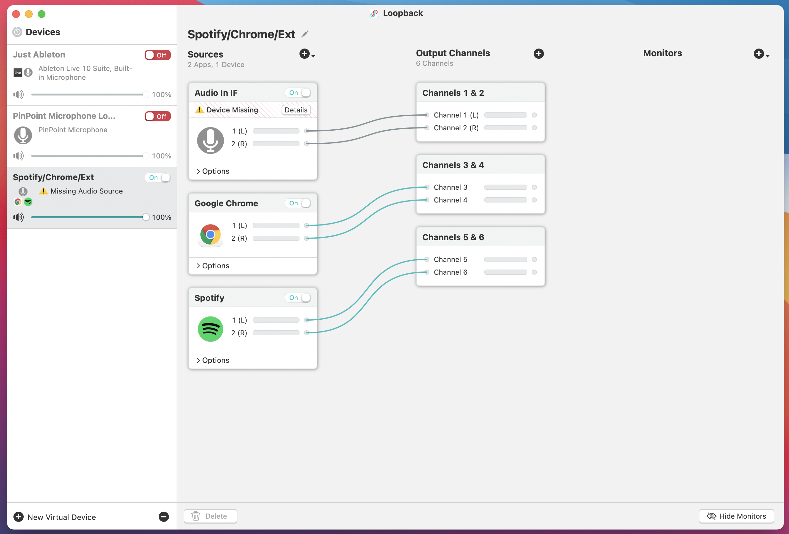

# Explorations in Ableton (Music + World Sounds)

*This branch is an exploration of audio effects on the listening environment that can be paired to/triggered by musical content.*

# Contents

#### SideChainCompressor.als

- Reactively adjust the volume of one's sound environment based on the low frequency content of incoming music signal. Good for electronic music with a lot of rhythmic kick sounds. e.g. techno music

#### SideChain_AutoFilter+Compressor.als

- Similar to the compresser, this one adds a auto filter before the signal path. So you get a swooshing filter open/closing sound when kicks are happening. 

#### SideChain_Vocoder.als

- Reactively changes the pitch of the sound environment based on incoming music signal. Works best on ambient music that have long evolving notes/chords (provide frequencies), paired with human speech (Provide envelopes and formants). A good representative would be Aphex Twin's [*#3*](https://open.spotify.com/track/2Bc4llhjJBW77I552RgA3L?si=fd3e138b771d4be6) 

#### Static_Blur.als

- Applies a heavy but adjustable reverb that blurs the sound environment.

#### Static_PitchHack.als

- A unique combination of delay and pitch shift that makes the world sound bonkers. 

***Requires loopback setup as follows:***
